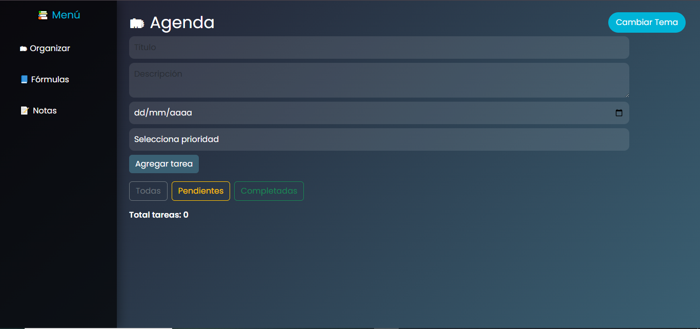
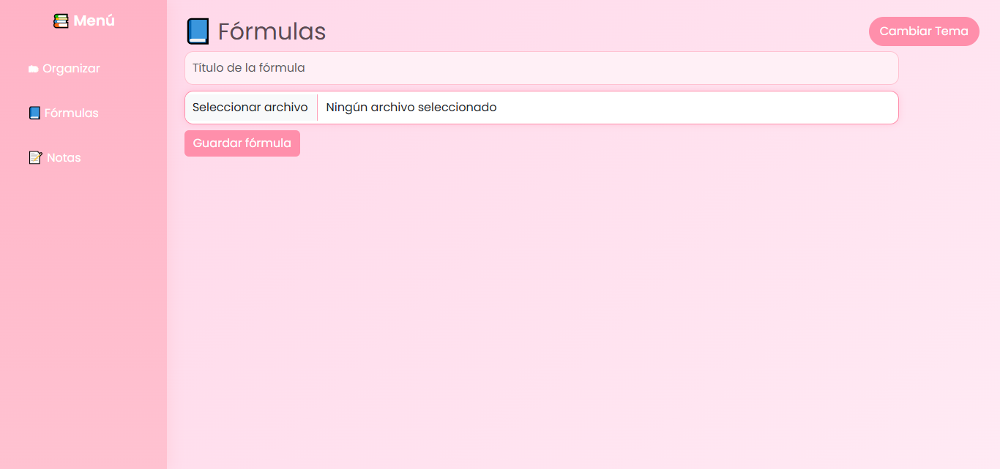
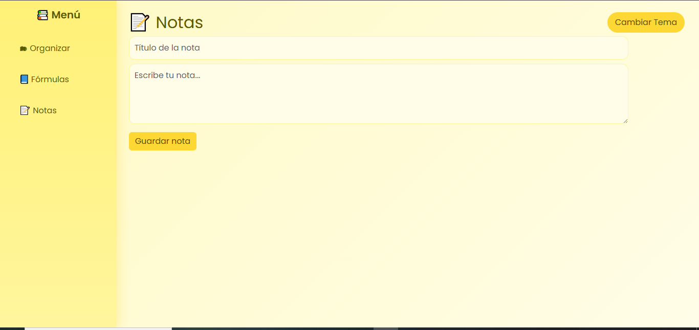
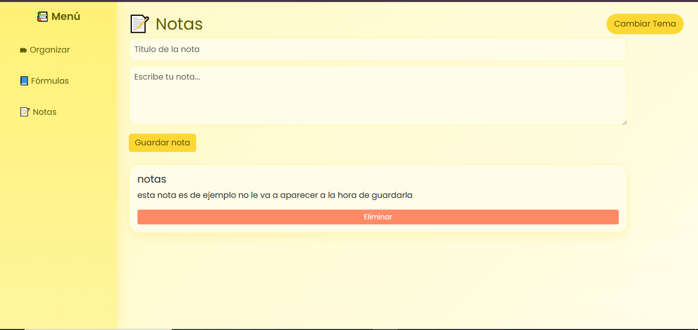
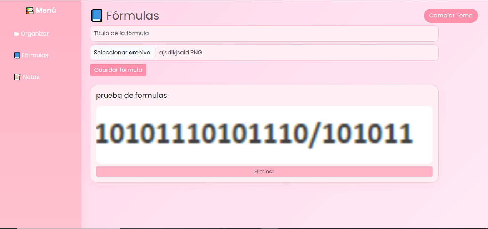

# 📚 Agenda y Notas (Proyecto Libre)

Aplicación web desarrollada con Vue 3 para gestionar tareas, guardar fórmulas como imágenes y crear notas rápidas.

---

## 🚀 Características

### 🗂 Agenda
- Crear tareas con:
  - Título
  - Descripción
  - Fecha
  - Prioridad (Alta, Media, Baja)
- Marcar tareas como completadas
- Filtrar por:
  - Todas
  - Pendientes
  - Completadas

### 📘 Fórmulas
- Subir imágenes desde el dispositivo
- Guardarlas con un título
- Eliminar fórmulas guardadas

### 📝 Notas
- Crear notas simples
- Visualizarlas en lista
- Eliminarlas

### 🎨 Temas
- Cambiar entre:
  - Tema oscuro
  - Tema rosa
  - Tema amarillo

---

## 🛠 Tecnologías usadas

- Vue 3
- JavaScript
- HTML5
- CSS3
- Bootstrap
- LocalStorage

---

## 📂 Estructura del proyecto

```
src/
 ├── App.vue        # Interfaz principal
 ├── main.js        # Punto de entrada
 ├── style.css      # Estilos personalizados

public/
 ├── index.html     # HTML base
 ├── imagenes/      # Capturas del proyecto

package.json        # Configuración y dependencias
```

---

## ⚙️ Instalación

1. Clona el repositorio o descarga el proyecto.
2. Abre la carpeta en Visual Studio Code.
3. Instala las dependencias:

```bash
npm install
```

---

## 💻 Ejecutar en modo desarrollo

```bash
npm run serve
```

Luego abre en tu navegador:

```
http://localhost:8080/
```

---

## 📦 Compilar para producción

```bash
npm run build
```

---

## 📝 Notas importantes

- Los datos (tareas, fórmulas y notas) se guardan en `localStorage`.
- No utiliza base de datos ni backend.
- Las imágenes se convierten en Data URL al guardarse.
- Si borras los datos del navegador, se perderá la información almacenada.

---

## 🖱️Link en render

https://proyecto-en-v.onrender.com/

---

## 🖼 Capturas del proyecto

<p align="center">
  
</p>

<p align="center">
  
</p>

<p align="center">
  
</p>

<p align="center">
  
</p>

<p align="center">
  
</p>

---

## Ideas para actualizaciones

-Agregar notificaciones


Proyecto desarrollado como trabajo libre utilizando Vue 3.
